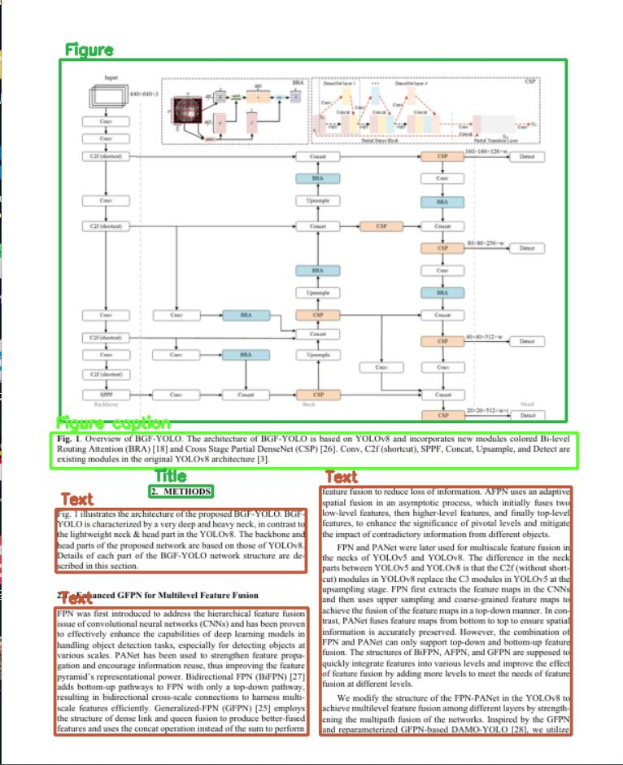

# pdfdet: PDF Layout Detection Toolbox



## Requirements

python>=3.10

```shell
python -m pip install -r requirements.txt
pip install .
```

## Usage

### Simple Operations

```bash
python main.py --path "pdf_path"
```

You can also import a model directly via its full name and then call its `__call__` method with pdf path or image path.

- Layer

    ```python
    from pdfdet import uni_model
    model = uni_model(name='yolov8m_cdla')
    layer = model(path="image_path")
    content  = layer.to_json()
    """
    content format:
    {
        "image": numpy.ndarray,
        "boxes": [{"box": [x1, y1, x2, y2], "label": str, "score": float}, ...],
    }
    """
    ```

- Document

    ```python
    from pdfdet import uni_model
    import cv2
    model = uni_model(name='yolov8m_cdla')
    doc = model(path="pdf_path")
    layers = sorted(doc.layers, key=lambda x: int(x))
    for i in layers:
        layer = getattr(doc, i)
        im = layer.imshow()
        im = cv2.resize(im, (640, 640))
        cv2.imshow("im", im)
        cv2.waitKey(0)
    cv2.destroyAllWindows()

    ```

### Batch processing

```bash
# batch predict
python tools/batch_process.py --model "model_name" --src "image_root" --save "res_root"
# generate visualize result
python tools/visualize.py "image_path" "res_path"
#
# evaluate cdla dataset(labelme format)
python tools/eval_map50.py "gt_root" "res_root"
```

## Models

| **Model**        | **Source**                                                                                                 | **Associated Dataset**                      |
| ---------------- | ---------------------------------------------------------------------------------------------------------- | ------------------------------------------- |
| **paddle_pub**   | [PaddlePaddle](https://github.com/PaddlePaddle/PaddleOCR/blob/release/2.6/ppstructure/layout/README_ch.md) | PubLayNet(English)                          |
| **paddle_cdla**  | [PaddlePaddle](https://github.com/PaddlePaddle/PaddleOCR/blob/release/2.6/ppstructure/layout/README_ch.md) | CDLA(Chinese)                               |
| **cnstd_yolov7** | [CNSTD](https://github.com/breezedeus/cnstd)                                                               | CDLA                                        |
| **yolov8l_doc**  | [huggingface](https://huggingface.co/egis-group/LayoutDetection)                                           | DocLayNet(English, German,French, Japanese) |
| **yolov8m_cdla** | [layout_analysis](https://github.com/jiangnanboy/layout_analysis)                                          | CDLA                                        |

[Evaluation Code Source](https://github.com/ultralytics/ultralytics/blob/2d513a9e4bf51e961a4199067383d2052f483874/ultralytics/utils/metrics.py#L620)

**Note**: Labels and annotation strategies vary across different datasets. Visual comparison should be the primary method for evaluating effectiveness.

### CDLA

[CDLA](https://github.com/buptlihang/CDLA)

| **Model**        | **map50** | **map50:95** | **p**  | **r**  |
| ---------------- | --------- | ------------ | ------ | ------ |
| **paddle_cdla**  | 0.9675    | 0.8359       | 0.9602 | 0.9347 |
| **cnstd_yolov7** | 0.9058    | 0.6662       | 0.9543 | 0.8321 |
| **yolov8m_cdla** | 0.9436    | 0.8086       | 0.9449 | 0.8980 |

### mnbvc

[Test Dataset](https://github.com/Ontheroad123/Layout-Analysis/tree/main/layout_modify)

| **Model**        | **map50:95** | **p**  | **r**  |
| ---------------- | ------------ | ------ | ------ |
| **paddle_cdla**  | 0.5717       | 0.5853 | 0.6248 |
| **cnstd_yolov7** | 0.5034       | 0.6278 | 0.5651 |
| **yolov8m_cdla** | 0.4783       | 0.5266 | 0.5922 |
